<div align="center">

# IronTurn

**RPG por turnos via console — Java puro, zero frameworks**


*Trabalho final da disciplina de Padrões de Projeto de Software*

</div>

---

## Sobre

IronTurn simula uma sequência de combates por turnos entre um herói (Guerreiro ou Mago) e sete inimigos progressivamente mais fortes. Cada classe possui mecânicas distintas, equipamentos próprios e um pool de drops contextualizado. Após zerar a campanha com **ambas** as classes, um **modo inimigo** é desbloqueado: o jogador encarna um dos monstros e enfrenta o próprio herói anterior como boss final.

O projeto aplica quatro padrões GoF — **Strategy**, **Decorator**, **Command** e **Observer** — cada um resolvendo um problema concreto de design surgido durante o desenvolvimento.

---

## Sumário

- [Compilação e Execução](#compilação-e-execução)
- [Como Jogar](#como-jogar)
- [Classes e Inimigos](#classes-e-inimigos)
- [Modo Inimigo](#modo-inimigo-desbloqueável)
- [Arquitetura](#arquitetura)
- [Fluxo de Jogo](#fluxo-de-jogo)
- [Padrões de Projeto](#padrões-de-projeto)
   - [Strategy](#strategy--comportamento-de-ataque-por-classe)
   - [Decorator](#decorator--equipamentos-sobre-personagens)
   - [Command](#command--ações-de-turno-com-undo)
   - [Observer](#observer--eventos-de-batalha)
- [Sistema de Itens](#sistema-de-itens)
- [Visão Geral (UML Consolidado)](#visão-geral-uml-consolidado)
- [Considerações Finais](#considerações-finais)

---

## Compilação e Execução

```bash
# A partir da raiz do projeto
find src -name "*.java" > sources.txt
javac -d out @sources.txt
java -cp out ironturn.Main
```

> [!NOTE]
> **Requisito:** Java 17 ou superior. O terminal deve suportar ANSI escape codes para renderizar cores e bordas — Linux, macOS e Windows Terminal modernos funcionam por padrão.

---

## Como Jogar

1. Selecione **`[1] Jogar`** no menu inicial.
2. Digite o nome do seu personagem.
3. Escolha sua classe: **Guerreiro** ou **Mago**.
4. Enfrente os sete inimigos em sequência.
5. A cada vitória, escolha um dos dois itens dropados.
6. Após vencer a campanha com ambas as classes, o **modo inimigo** desbloqueia.

### Sequência de Combate

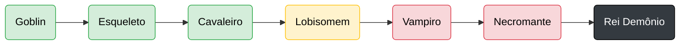

> Vampiro, Necromante e Rei Demônio possuem mecânica de **fúria**.

### Ações por Turno

O menu se adapta dinamicamente à classe e ao contexto:

| Ação | Disponível para | Gasta turno? | Descrição |
|------|------|:---:|------|
| **Atacar** | Ambos | sim | Aplica a estratégia da classe |
| **Defender** | Guerreiro | sim | Dobra a DEF, devolve dano reflexivo |
| **Reverter Turno** | Mago | não | Desfaz último ataque do herói + inimigo (1/inimigo) |
| **Reverter Batalha** | Mago | não | Restaura HPs e pilha ao início do combate (1/inimigo) |
| **Usar Pergaminho** | Guerreiro (≤30% HP) | sim | Cura 50% do HP máximo |
| **Preparar Proteção** | Mago (com Chifre) | sim | Arma intercepção fatal pelo Guerreiro |
| **Ver Status** | Ambos | não | Exibe stats, equipamentos e inventário |

---

## Classes e Inimigos

### Classes Jogáveis

| Classe | HP | ATK | DEF | Equipamento Inicial | Habilidade |
|--------|:---:|:---:|:---:|------|------|
| **Guerreiro** | 120 | 20 → **30** | 15 → **23** | Espada (+10 ATK)<br>Escudo (+8 DEF) | Crítico 7% (×2)<br>Penetração 10% |
| **Mago** | 80 → **110** | 15 → **30** | 5 | Amuleto (+15 ATK, +30 HP máx) | Reverter turno<br>Reverter batalha |

> [!TIP]
> Valores em **negrito** são os efetivos após equipar os itens iniciais — aplicados via `Decorator`, não como modificações diretas no `Hero`.

### Inimigos

| # | Inimigo | HP | ATK | DEF | Especial |
|:---:|--------|:---:|:---:|:---:|:---:|
| 1 | Goblin | 45 | 15 | 3 | — |
| 2 | Esqueleto | 62 | 20 | 5 | — |
| 3 | Cavaleiro | 80 | 26 | 8 | — |
| 4 | Lobisomem | 95 | 30 | 10 | — |
| 5 | Vampiro | 110 | 34 | 12 | Fúria |
| 6 | Necromante | 125 | 38 | 14 | Fúria |
| 7 | Rei Demônio | 145 | 44 | 16 | Fúria |

> [!WARNING]
> **Fúria** ativa quando o HP do inimigo cai a ≤30% — reduz o HP do herói ao limiar de 30% do máximo (caso esteja acima). Uso único por inimigo.

Stats variam **±15%** na criação. O ataque sofre uma variação adicional de **±20%** no momento do golpe.

---

## Modo Inimigo (desbloqueável)

> [!IMPORTANT]
> Disponível apenas após zerar a campanha com **Guerreiro e Mago**.

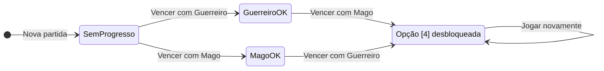

**Como o roster é montado:**

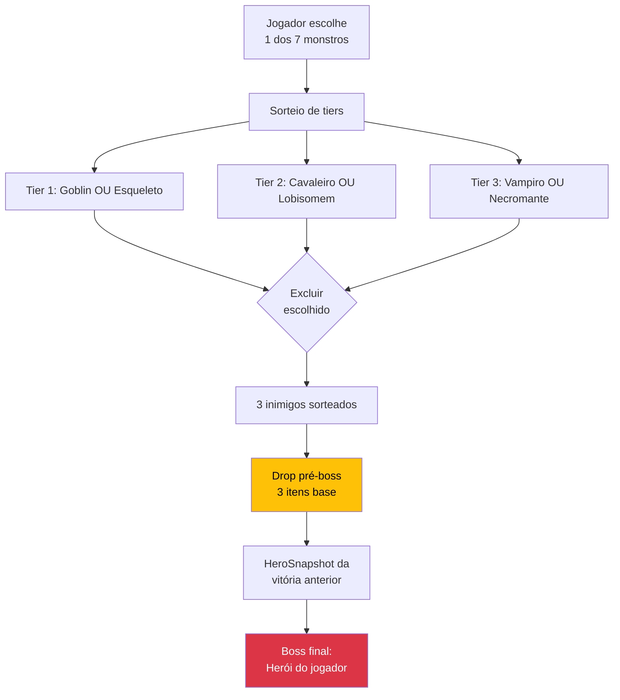

- Jogador escolhe um dos sete monstros do roster.
- A classe do boss final é sorteada (Guerreiro ou Mago).
- A sequência é montada por **tiers**, excluindo o próprio personagem do jogador.
- O quarto e último inimigo é o **herói boss**, reconstruído a partir do `HeroSnapshot` da vitória anterior.
- O jogador ganha um drop antes do confronto final (3 itens base à escolha).
- Mecânica de **fúria** disponível ao cair em ≤30% HP — consome o turno, reduz o HP do boss ao limiar de 30%.

---

## Arquitetura

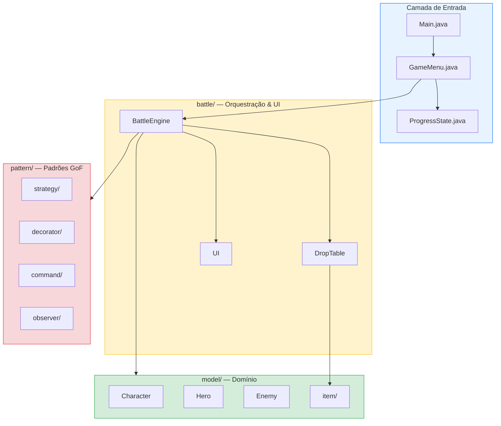

A separação `model/` × `pattern/` × `battle/` isola três camadas: **dados/regras de domínio**, **mecanismos de extensão (padrões GoF)** e **orquestração + apresentação**. `Main`, `GameMenu` e `ProgressState` ficam na raiz por serem pontos de entrada.

---

## Fluxo de Jogo

O loop principal do `BattleEngine`:

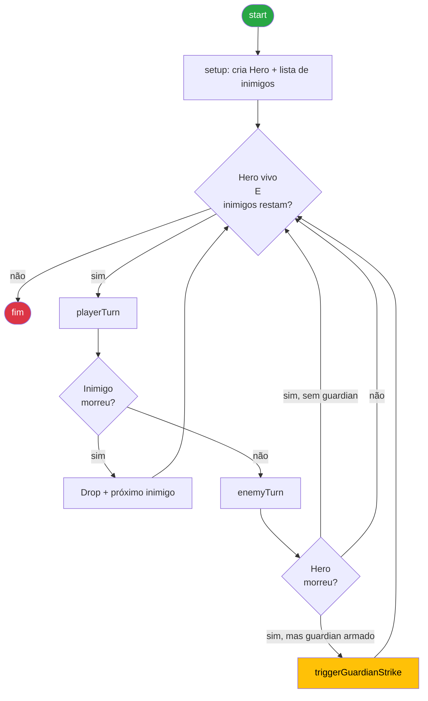

---

## Padrões de Projeto

### Strategy — comportamento de ataque por classe

> `pattern/strategy/` · `AttackStrategy`, `WarriorAttack`, `MageAttack`

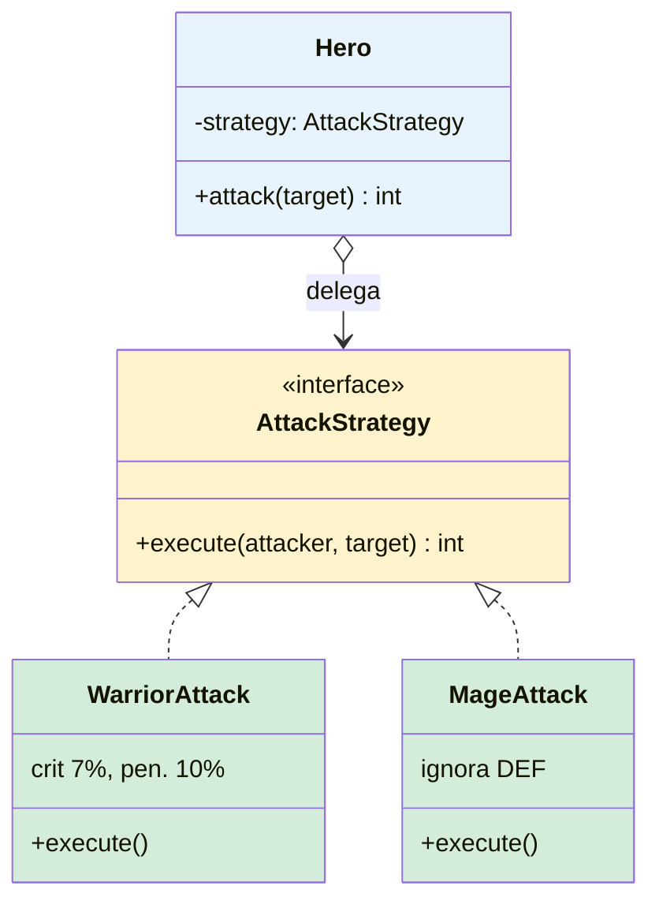

<details>
<summary><b>Como funciona</b></summary>

A interface `AttackStrategy` define `int execute(Character attacker, Character target)`. Cada classe concreta encapsula uma fórmula:

- **`WarriorAttack`** — 10% de chance de penetrar armadura (ATK puro), caso contrário `max(0, ATK − DEF)`. Em cima do resultado, 7% de chance de crítico (×2).
- **`MageAttack`** — retorna `attacker.getAtk()` direto, ignorando completamente a DEF do alvo.

```java
@Override
public int attack(Character target) {
    return strategy.execute(this, target);   // Hero delega ao Strategy
}
```

A estratégia é injetada no `Hero` via construtor — nenhum acoplamento entre o tipo do herói e o algoritmo de ataque.

</details>

**Por quê:** As duas classes têm fórmulas de dano **fundamentalmente diferentes** — não é parametrização (HP/ATK/DEF), é algoritmo diferente. Usar herança (`Warrior extends Hero`, `Mage extends Hero`) acoplaria o tipo do herói à fórmula, dificultando, por exemplo, um inimigo que use a estratégia de mago ou um buff temporário que troque o algoritmo. Strategy desacopla o "**o que ataca**" do "**como ataca**". O roster do modo inimigo escolhe dinamicamente entre `WarriorAttack` e `MageAttack` por string (`chosen[4].equals("mage")`) — isso só foi possível por causa dessa separação.

---

### Decorator — equipamentos sobre personagens

> `pattern/decorator/` · `CharacterDecorator`, `SwordDecorator`, `ShieldDecorator`, `AmuletDecorator`, `FlameCloakDecorator`

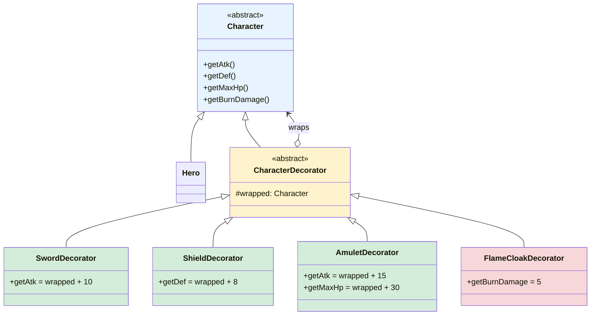

**Composição em runtime (exemplo do Guerreiro):**

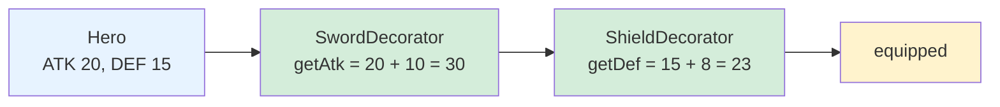

<details>
<summary><b>Como funciona</b></summary>

`CharacterDecorator extends Character` e mantém uma referência ao `Character` envolvido. Cada decorator concreto sobrescreve apenas os getters que modifica:

```java
public class SwordDecorator extends CharacterDecorator {
    public SwordDecorator(Character wrapped) { super(wrapped); }
    @Override public int getAtk() { return wrapped.getAtk() + 10; }
}
```

- **Guerreiro:** `new ShieldDecorator(new SwordDecorator(hero))`
- **Mago:** `new AmuletDecorator(hero)`
- **`FlameCloakDecorator`** é aplicado dinamicamente quando o Mago coleta o Manto de Chamas, envolvendo a cadeia já existente sem reescrevê-la.

</details>

**Por quê:** Os equipamentos não são apenas dados — eles alteram o comportamento do personagem em vários eixos (ATK, DEF, HP máximo) e, no caso do `FlameCloakDecorator`, adicionam um efeito ativo (burn por ação). Implementar isso como `List<Modifier>` exigiria que o `Character` consultasse a lista a cada chamada de getter, espalhando lógica de equipamento pelo domínio. Decorator concentra cada efeito numa classe própria e permite **composição livre em runtime**. A aplicação tardia do `FlameCloakDecorator` (sobre uma instância já decorada, mid-game) é o que torna esse padrão a escolha natural — herança rígida não permitiria isso.

> [!NOTE]
> Como reforço incidental, `UI.FramedOutputStream` também aplica Decorator (sobre `OutputStream`), seguindo o mesmo idioma da JDK (`BufferedOutputStream`, `FilterOutputStream`). É como toda a saída do terminal é "emoldurada" sem modificar nenhuma classe que escreve em `System.out`.

---

### Command — ações de turno com undo

> `pattern/command/` · `TurnCommand`, `AttackCommand`, `GuardCommand`, `CommandHistory`

```mermaid
classDiagram
    class TurnCommand {
        <<interface>>
        +execute()
        +undo()
    }
    class AttackCommand {
        -attacker, target
        -damageDealt
        +execute()
        +undo()
    }
    class GuardCommand {
        -hero, enemy
        -defBonus
        +execute()
        +revert()
        (variante intencional)
    }
    class CommandHistory {
        -stack: Stack~TurnCommand~
        +push(cmd)
        +undo()
        +clear()
    }

    TurnCommand <|.. AttackCommand
    CommandHistory o--> TurnCommand : empilha

    style TurnCommand fill:#fff3cd
    style AttackCommand fill:#d4edda
    style GuardCommand fill:#f8d7da
    style CommandHistory fill:#e7f3ff
```

**Sequência "Reverter Turno" (habilidade do Mago):**

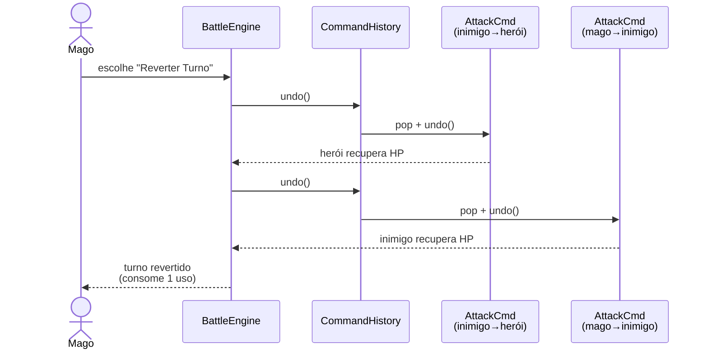

<details>
<summary><b>Como funciona</b></summary>

`TurnCommand` define `execute()` e `undo()`. `AttackCommand` registra o dano causado e o desfaz na reversão. `CommandHistory` mantém uma pilha LIFO.

O **`GuardCommand`** é uma **variante intencional** do padrão: usa `execute()` + `revert()` em vez de `execute()` + `undo()`, e não implementa `TurnCommand`. A semântica é diferente:
- `undo` → reversão arbitrária acionada pelo jogador a qualquer momento.
- `revert` → expiração natural da defesa ao fim do turno.

Manter os dois conceitos separados (em vez de forçar `GuardCommand` na mesma interface) deixa claro o ciclo de vida de cada um.

</details>

**Por quê:** A habilidade de reverter turnos é o **diferencial mecânico do Mago**. Sem Command, "desfazer um ataque" exigiria gravar o estado completo do personagem antes de cada ação (snapshot), o que é caro e propenso a bugs. Command encapsula **a transformação reversível** num único objeto que sabe como aplicá-la e como revertê-la. Como bônus, o mesmo padrão habilitou a **intercepção da morte pelo guardião** (Chifre da Irmandade): quando o ataque do inimigo mataria o herói, a engine chama `cmd.undo()` para anular o golpe, e despacha o contra-ataque combinado.

---

### Observer — eventos de batalha

> `pattern/observer/` · `BattleObserver`, `BattleEvent`, `BattleLogger`, `StatusDisplay`

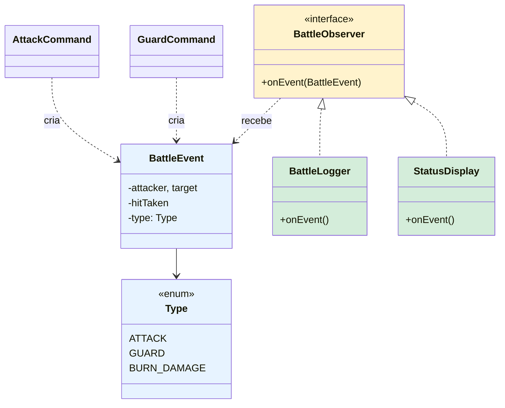

**Sequência de notificação:**

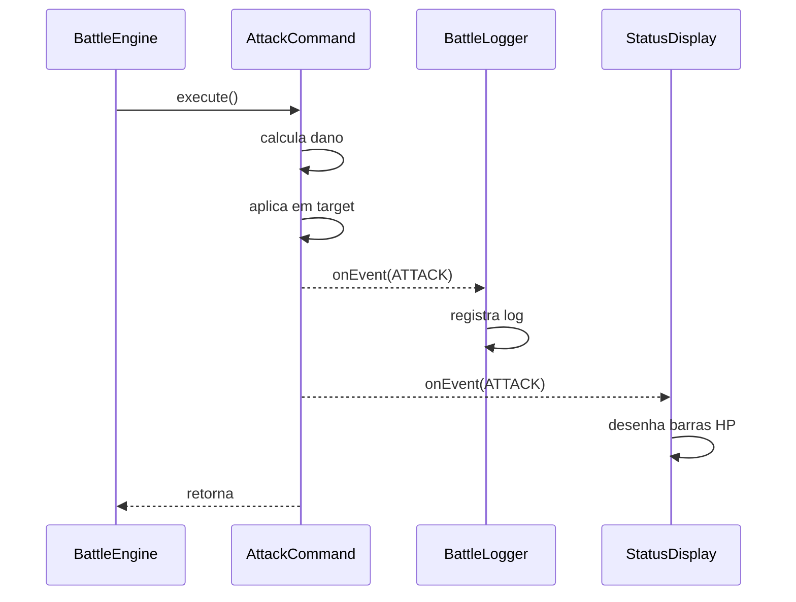

<details>
<summary><b>Como funciona</b></summary>

`BattleObserver` define `onEvent(BattleEvent e)`. `BattleEvent` é um objeto imutável carregando atacante, alvo, dano e tipo (`ATTACK`, `GUARD`, `BURN_DAMAGE`). A engine mantém uma `List<BattleObserver>` e notifica todos após cada evento:

```java
for (BattleObserver o : observers)
    o.onEvent(new BattleEvent(hero, enemy, damage, Type.ATTACK));
```

- **`BattleLogger`** registra texto formatado de cada evento.
- **`StatusDisplay`** desenha barras de HP coloridas (ignora `BURN_DAMAGE` para evitar duplicar a barra já desenhada pelo `applyBurn`).

</details>

**Por quê:** Logging e renderização de status são **responsabilidades transversais** — toda ação de combate precisa atualizar a tela e o histórico. Sem Observer, cada `Command` precisaria conhecer `BattleLogger`, `StatusDisplay` (e qualquer futuro observador) e chamá-los manualmente, espalhando dependências. Com Observer, `AttackCommand` e `GuardCommand` recebem a lista no construtor e disparam um único evento; **quem reage é problema dos observadores**. Adicionar um novo tipo de reação (estatísticas, conquistas, gravação para replay) não exige tocar em uma única linha dos commands.

---

## Sistema de Itens

Drops são definidos por `DropTable`, com uma pool ponderada compartilhada e adições contextuais por classe.

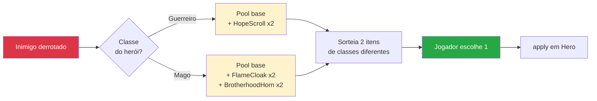

### Pool Base (disponível para ambos)

| Item | Peso | Efeito |
|------|:---:|------|
| **Poção de Cura** | 3 | +40 HP |
| **Gema de Sangue** | 3 | +10 ATK permanente |
| **Runa do Guardião** | 3 | +5 DEF permanente |
| **Cristal da Ruína** | 2 | +15 ATK permanente |
| **Elixir da Vida** | 1 | Cura completa |
| **Defesa Divina** | 1 | +15 DEF permanente |

### Itens Exclusivos por Classe

| Item | Classe | Peso | Efeito |
|------|:---:|:---:|------|
| **Pergaminho Misterioso** | Guerreiro | 2 | Habilita cura de 50% HP em emergência (≤30% HP) |
| **Manto de Chamas** | Mago | 2 | Aplica `FlameCloakDecorator` — 5 burn/ação |
| **Chifre da Irmandade** | Mago | 2 | Arma intercepção fatal (golpe combinado) |

Cada drop apresenta **dois itens de tipos diferentes** ao jogador. O modo inimigo usa apenas a pool base (sem exclusivos).

### Narrativa Cruzada

`HopeScroll` e `BrotherhoodHorn` formam uma narrativa entrelaçada:

> O Guerreiro recebe um pergaminho com palavras em latim do Mago:
> *"Frater, ubi umbra te vincit — lux mea te quaeret."*
>
> O Mago carrega um chifre **"forjado no mesmo fogo, partido ao meio"**.

Quando o Mago ativa o chifre e está prestes a morrer, o Guerreiro intervém com um golpe combinado:

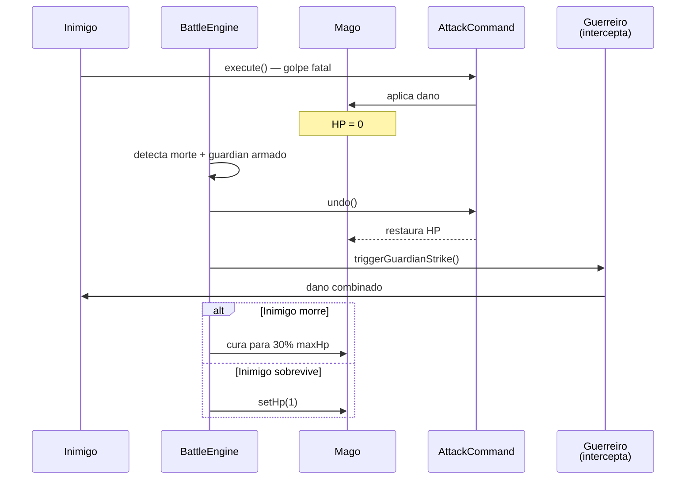

---

## Visão Geral (UML Consolidado)

<details>
<summary><b>Diagrama completo de todas as classes principais</b></summary>

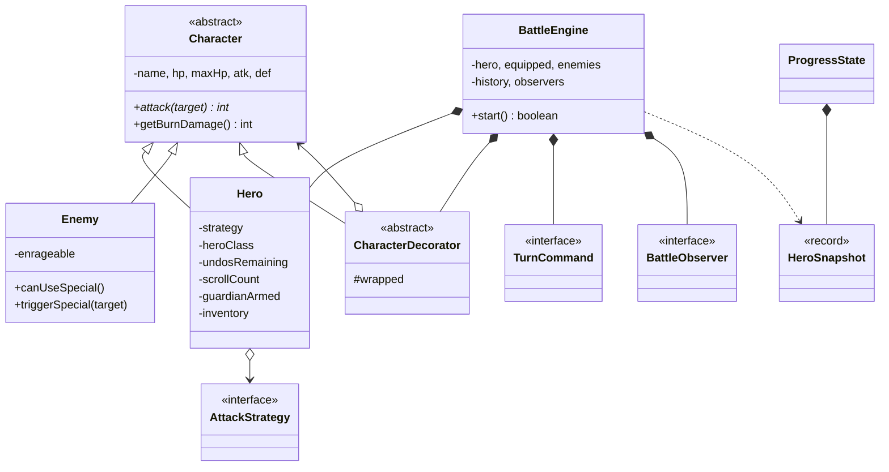

</details>

<details>
<summary><b>Estrutura de Pacotes (completa)</b></summary>

```
ironturn/
├── Main.java
├── GameMenu.java
├── ProgressState.java
├── battle/
│   ├── BattleEngine.java
│   ├── DropTable.java
│   └── UI.java
├── model/
│   ├── Character.java
│   ├── Enemy.java
│   ├── Hero.java
│   ├── HeroClass.java
│   ├── HeroSnapshot.java
│   └── item/
│       ├── Item.java
│       ├── AttackGem.java
│       ├── BrotherhoodHorn.java
│       ├── DefenseRune.java
│       ├── DivineDefense.java
│       ├── FlameCloak.java
│       ├── HealingPotion.java
│       ├── HopeScroll.java
│       ├── LifeElixir.java
│       └── PowerCrystal.java
└── pattern/
    ├── command/
    │   ├── AttackCommand.java
    │   ├── CommandHistory.java
    │   ├── GuardCommand.java
    │   └── TurnCommand.java
    ├── decorator/
    │   ├── AmuletDecorator.java
    │   ├── CharacterDecorator.java
    │   ├── FlameCloakDecorator.java
    │   ├── ShieldDecorator.java
    │   └── SwordDecorator.java
    ├── observer/
    │   ├── BattleEvent.java
    │   ├── BattleLogger.java
    │   ├── BattleObserver.java
    │   └── StatusDisplay.java
    └── strategy/
        ├── AttackStrategy.java
        ├── MageAttack.java
        └── WarriorAttack.java
```

</details>

---

## Considerações Finais

O escopo inicial pedia 3 padrões e dois personagens contra três inimigos. O projeto cresceu para **quatro padrões** (Strategy, Decorator, Command, Observer) e **sete inimigos**, mais um **modo inimigo** desbloqueável e um **sistema de drops contextual**.

Cada expansão foi motivada por uma necessidade concreta:

- **Sistema de drops** (`DropTable` + `Item`) nasceu da vontade de tornar a progressão variada — mas só foi viável porque o **Decorator** permitia adicionar equipamentos em runtime sem reescrever o modelo.

- **Modo inimigo** exigiu transferir stats entre duas instâncias de `BattleEngine`. Foi resolvido com um `record HeroSnapshot` imutável, evitando vazar referências mutáveis entre os modos.

- **Intercepção fatal pelo guardião** (Chifre da Irmandade) parecia uma feature narrativa, mas mecanicamente é uma aplicação direta do **Command.undo()**: o golpe que mataria o herói é desfeito, e a engine despacha um contra-ataque.

> Os padrões não foram escolhidos para encaixar — foram escolhidos porque cada um resolveu um problema concreto que apareceu durante o desenvolvimento.

A documentação acima foi reescrita após a estabilização do código, refletindo o que de fato ficou no projeto e não o plano original.

---

## Fora do Escopo

- Persistência (save/load) — o `ProgressState` vive apenas durante a sessão.
- Mapa ou movimentação.
- Inventário com progressão de nível.
- Frameworks externos *(zero dependências além da JDK)*.

---

<div align="center">

*Desenvolvido em Java 17*

</div>